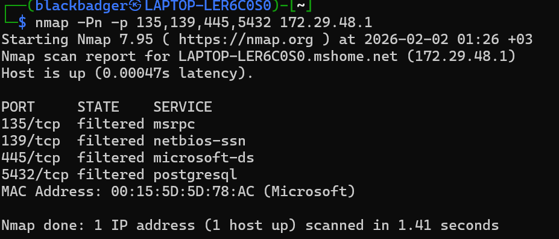
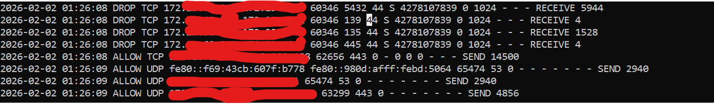

## Evidence & Validation

### Port Scan Simulation
An Nmap scan was executed from Kali Linux (WSL2) against the Windows host to simulate reconnaissance activity.

### Firewall Detection & Blocking
Windows Firewall successfully blocked inbound scan attempts and logged dropped packets.

Sample log entries are included in `blocked_scan.log`.
